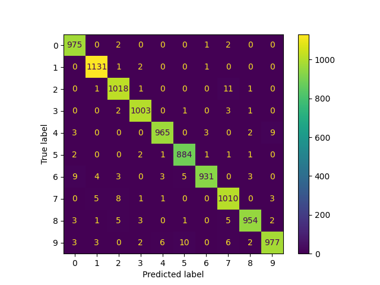

# Project Title

A brief description of what this project does and who it's for.

## Installation 

Install project dependencies:

```bash
pip install -r requirements.txt
```

# Running the project
Execute the following command:

```bash
python parse_mnist.py
```

# Architecture
To solve this problem we've used the following architecture:
- Pytorch
- Convolutional Neural Network (CNN)
- Adam optimizer
- 

# Results
With 10 epochs, we've achieved 98% precision on the test dataset.

After every epoch, we test the trained model on the test dataset. The model is saved after the last epoch.